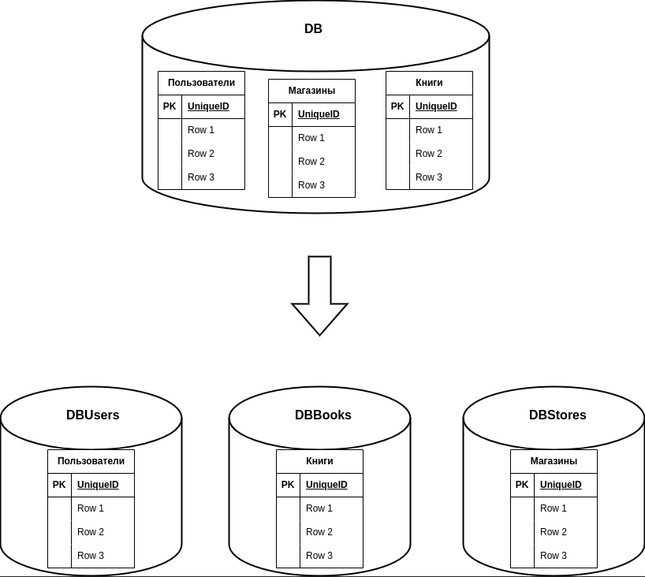
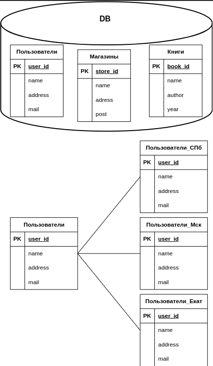

# Домашнее задание к занятию «Репликация и масштабирование. Часть 2»

### Инструкция по выполнению домашнего задания

1. Сделайте fork [репозитория c шаблоном решения](https://github.com/netology-code/sys-pattern-homework) к себе в Github и переименуйте его по названию или номеру занятия, например, https://github.com/имя-вашего-репозитория/gitlab-hw или https://github.com/имя-вашего-репозитория/8-03-hw).
2. Выполните клонирование этого репозитория к себе на ПК с помощью команды `git clone`.
3. Выполните домашнее задание и заполните у себя локально этот файл README.md:
   - впишите вверху название занятия и ваши фамилию и имя;
   - в каждом задании добавьте решение в требуемом виде: текст/код/скриншоты/ссылка;
   - для корректного добавления скриншотов воспользуйтесь инструкцией [«Как вставить скриншот в шаблон с решением»](https://github.com/netology-code/sys-pattern-homework/blob/main/screen-instruction.md);
   - при оформлении используйте возможности языка разметки md. Коротко об этом можно посмотреть в [инструкции по MarkDown](https://github.com/netology-code/sys-pattern-homework/blob/main/md-instruction.md).
4. После завершения работы над домашним заданием сделайте коммит (`git commit -m "comment"`) и отправьте его на Github (`git push origin`).
5. Для проверки домашнего задания преподавателем в личном кабинете прикрепите и отправьте ссылку на решение в виде md-файла в вашем Github.
6. Любые вопросы задавайте в чате учебной группы и/или в разделе «Вопросы по заданию» в личном кабинете.

Желаем успехов в выполнении домашнего задания.

---

### Задание 1

Опишите основные преимущества использования масштабирования методами:

- активный master-сервер и пассивный репликационный slave-сервер; 
- master-сервер и несколько slave-серверов;
- активный сервер со специальным механизмом репликации — distributed replicated block device (DRBD);
- SAN-кластер.

*Дайте ответ в свободной форме.*

### Ответ

Активный master-сервер и пассивный репликационный slave-сервер:

Преимущества:
- Высокая отказоустойчивость: Если master-сервер выходит из строя, slave-сервер может принять роль master и продолжить обработку запросов.
- Распределение нагрузки на чтение: Slave-серверы могут использоваться для обработки запросов на чтение, разгружая таким образом мастер-сервер и увеличивая общую производительность системы.
- Возможность выполнять обслуживание и настройку slave-серверов без прерывания работы master-сервера.

Master-сервер и несколько slave-серверов:

Преимущества:
- Еще большая отказоустойчивость: Если master-сервер выходит из строя, один из slave-серверов может быстро занять его место и стать новым master.
- Шкалируемость на запись: Разделение нагрузки записи между несколькими серверами позволяет обрабатывать большой объем транзакций и обеспечивает увеличение пропускной способности системы.
- Шкалируемость на чтение: Slave-серверы могут использоваться для параллельной обработки запросов на чтение и повышения производительности системы.

Активный сервер со специальным механизмом репликации — distributed replicated block device (DRBD):

Преимущества:
- Высокая доступность данных: DRBD предоставляет специальный механизм блочного уровня для репликации данных между активным и пассивным серверами, обеспечивая непрерывную доступность данных.
- Мгновенный переключение ролей: Если активный сервер выходит из строя, пассивный сервер может мгновенно занять его место и продолжить обработку запросов.
- Простая настройка и управление: DRBD интегрирован с операционной системой и позволяет управлять репликацией данных с помощью стандартных инструментов и настроек.

SAN-кластер:

Преимущества:
- Высокая производительность: SAN-кластеры предоставляют высокоскоростное хранилище с низкой задержкой доступа, что обеспечивает быструю обработку транзакций.
- Шкалируемость: Кластеры могут быть расширены путем добавления новых узлов и хранилищ, что позволяет увеличить емкость и пропускную способность системы.
- Отказоустойчивость: SAN-кластеры имеют встроенные механизмы отказоустойчивости, такие как дублирование данных и резервирование ресурсов, чтобы предотвратить потерю данных и простои системы.

Каждый из этих подходов имеет свои особенности и выбор конкретного метода зависит от требований к производительности, доступности и масштабируемости системы.

---

### Задание 2

Разработайте план для выполнения горизонтального и вертикального шаринга базы данных. База данных состоит из трёх таблиц: 

- пользователи, 
- книги, 
- магазины (столбцы произвольно). 

Опишите принципы построения системы и их разграничение или разбивку между базами данных.

*Пришлите блоксхему, где и что будет располагаться. Опишите, в каких режимах будут работать сервера.* 

### Ответ

### Горизонтальный шардинг
Можем разделить таблицы пользователи и магазины по региональному признаку. Т.е. таблицу пользователи разбиваем по мажорной части адреса регистрации/проживания пользователя и/или таблицу магазины делим по мажорной части адреса регистрации/нахождения магазина. Мажорная часть адреса это, например, регион (или область, или город).

Блок-схема горизонтального шардинга

### Вертикальный шардинг
Разносим три таблицы по трем отдельным базам/серверам: UsersDB, BooksDB и StoresDB соотвественно. Связь между базами осуществляем программно, т.е. посредством микросервисов. Или можем разнести полученные при горизонтальном шардинге таблицы на разные сервера.

Блок-схема вертикального шардинга

